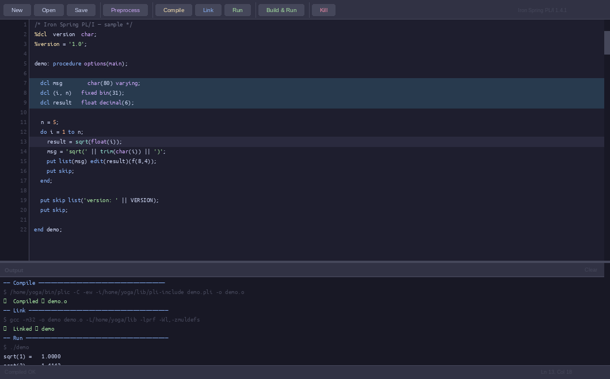
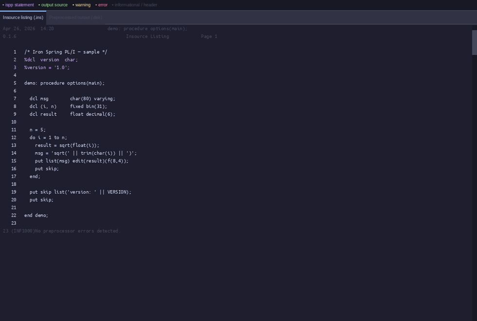

# Iron Spring PL/I IDE

A lightweight Python/tkinter IDE for writing, preprocessing, compiling, and
running PL/I programs on WSL2, built on the
[Iron Spring PL/I](http://www.iron-spring.com/) compiler.



---

## Features

- Syntax-highlighted editor (keywords, types, built-ins, strings, comments, preprocessor tokens)
- Full [Iron Spring PL/I Preprocessor](http://www.iron-spring.com/Iron-SpringPLIPreprocessor.pdf) support — `%dcl`, `%if/%then/%else`, `%do/%end`, `%activate`, `%procedure`, assignments, and more
- Preprocessor View window — insource listing tab + expanded output tab

  

- Inline diagnostics — error/warning markers in the gutter, highlighted lines, clickable links
- Find & Replace bar (`Ctrl+F` / `Ctrl+H`)
- One-click Compile → Link → Run pipeline

---

## Requirements

| Component | Version | Notes |
|-----------|---------|-------|
| WSL2 distro | Ubuntu 22.04 LTS (x86_64) | WSLg required for GUI |
| Python | 3.10 | with tkinter |
| gcc-multilib | system | 32-bit linking |
| Iron Spring PL/I compiler | 1.4.1 | `plic` |
| Iron Spring PL/I Preprocessor | 0.1.6+ | `ispp` |

---

## Installation

### 1 — System packages

```bash
sudo apt update
sudo apt install python3.10 python3.10-tk gcc-multilib
```

### 2 — Iron Spring PL/I compiler

```bash
cd /tmp
curl -O http://www.iron-spring.com/pli-1.4.1.tgz
tar xzf pli-1.4.1.tgz

mkdir -p ~/bin ~/lib ~/lib/pli-include
cp pli-1.4.1/plic        ~/bin/plic-1.4.1
ln -fs ~/bin/plic-1.4.1  ~/bin/plic
cp pli-1.4.1/lib/libprf.a           ~/lib/libprf.a
cp -r pli-1.4.1/lib/include/.       ~/lib/pli-include/
```

Add `~/bin` to your PATH (add to `~/.bashrc`):

```bash
export PATH="$HOME/bin:$PATH"
```

### 3 — Iron Spring PL/I Preprocessor

Download `ispp` from <http://www.iron-spring.com/download> and install:

```bash
sudo cp ispp /usr/bin/ispp
sudo chmod +x /usr/bin/ispp
```

### 4 — Clone the IDE

```bash
git clone https://github.com/markons/ispl1ide.git
```

---

## Running

```bash
python3 ispl1ide/pli_ide.py &
```

Or add a shell alias to `~/.bashrc`:

```bash
alias pli-ide='python3 ~/ispl1ide/pli_ide.py &'
```

---

## Quick tour

| Shortcut / button | Action |
|-------------------|--------|
| `Ctrl+S` | Save |
| `Ctrl+Z` / `Ctrl+Y` | Undo / Redo |
| **Preprocess** | Run `ispp`, open Preprocessor View |
| **Compile** | Auto-preprocess if needed, then `plic -C` |
| **Link** | `gcc -m32 … -lprf` |
| **Run** | Execute the binary, stream stdout |
| **Build & Run** | Compile → Link → Run in one step |
| `Ctrl+F` | Find |
| `Ctrl+H` | Find & Replace |
| `F3` / `Shift+F3` | Next / previous match |
| `Escape` | Close Find bar |

After compilation the IDE reads the `.lst` file and shows errors and warnings
inline — gutter strip, highlighted line, and clickable links in the Output pane.
Diagnostic line numbers are automatically remapped through the preprocessor
listing so they always point to the correct line in your original source.

---

## File layout

```
ispl1ide/
└── pli_ide.py      # the IDE — single Python file, no dependencies beyond tkinter
```

Intermediate files produced alongside your source (e.g. `hello.pli`):

| File | Produced by | Purpose |
|------|-------------|---------|
| `hello.dek` | `ispp` | Preprocessed source |
| `hello.ins` | `ispp -li` | Insource listing (original line numbers) |
| `hello.lst` | `plic` | Compiler listing with diagnostics |
| `hello.o` | `plic -C` | Object file |
| `hello` | `gcc -m32` | Linked executable |

---

## Resources

- Iron Spring PL/I compiler: <http://www.iron-spring.com/>
- Preprocessor reference: <http://www.iron-spring.com/Iron-SpringPLIPreprocessor.pdf>
- Release notes (Linux): <http://www.iron-spring.com/readme_linux.html>
- User forum: <https://groups.io/g/Iron-Spring>
